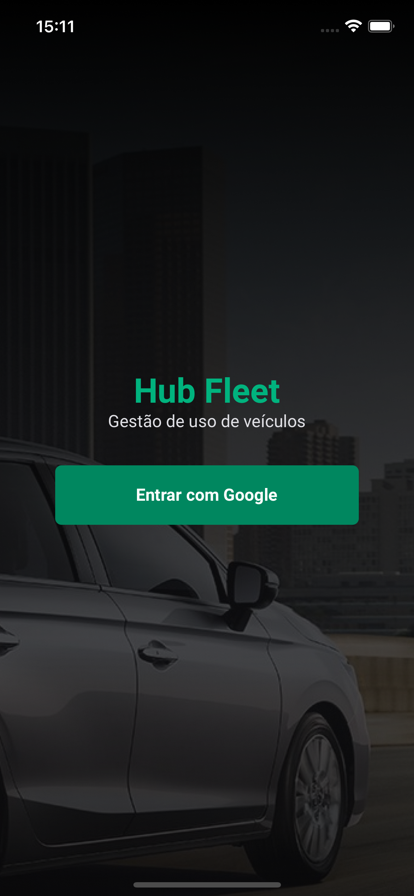
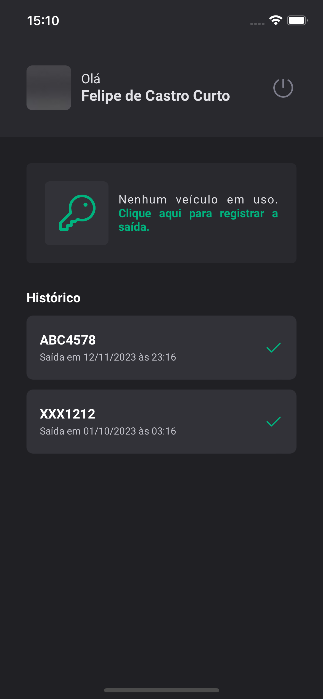
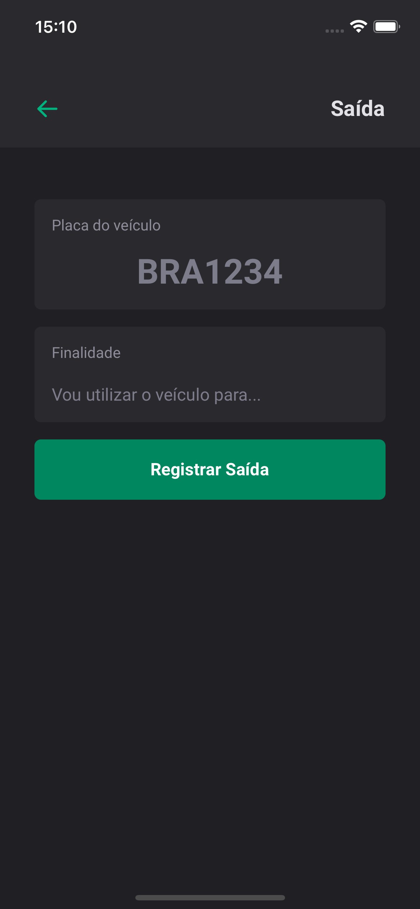
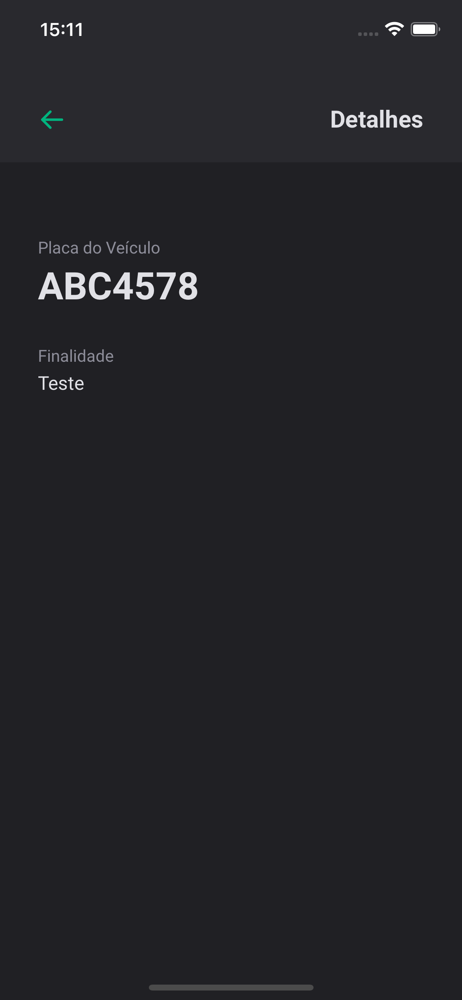

# Hubfleet

## O que é necessário para testar essa aplicação?

- Ter o [Node.js](https://nodejs.org/en) instalado acima da versão 18;
- Ter o gerenciador de pacotes [Yarn](https://yarnpkg.com/) instalado;
- Simuladores: [Xcode](https://developer.apple.com/xcode/) ou [Android Studio](https://developer.android.com/)

## Principais Tecnologias Utilizadas

- [React-Native](https://reactnative.dev/)
- [Expo](https://expo.dev/)
- [TypeScript](https://www.typescriptlang.org/)
- [Styled-components](https://styled-components.com/)
- [React Navigation](https://reactnavigation.org/)
- [Realm](https://realm.io/)
- [GCP](https://cloud.google.com/)
- [MongoDB Atlas](https://www.mongodb.com/atlas/database)

## Variáveis de Ambiente

Para rodar esse projeto, você vai precisar adicionar as seguintes variáveis de ambiente no seu .env

`ANDROID_CLIENT_ID`

`IOS_CLIENT_ID`

`REALM_APP_ID`

## Rodando Localmente

Clone o projeto

```bash
  git clone https://github.com/flpcastro/hubfleet.git
```

Entre no diretório do projeto

```bash
  cd hubfleet
```

Instale as dependências

```bash
  yarn
```

Execute no emulador de sua preferência

```bash
  npx expo run:ios
  npx expo run:android
```

# Fluxo de Login

- OAuth2 Protocol
- Camada PKCE retorna o token via deep link redirect
- Armazena o token e infos no MongoDB Atlas

```
hubfleet
├── android/
├── assets/
├── ios/
├── src/
│   ├── @types/
│   ├── assets/
│   ├── components/
│   ├── libs/
│   │   └── asyncStorage/
│   │   └── dayjs/
│   │   └── realm/
│   ├── routes/
│   ├── screens/
│   ├── theme/
│   ├── utils/
├── .env.example
├── .gitignore
├── app.json
├── App.tsx
├── babel.config.js
├── package.json
├── README.md
└── tsconfig.json
└── yarn.lock
```

## Documentação de cores

| Cor         | Hexadecimal                                                      |
| ----------- | ---------------------------------------------------------------- |
| White       |  #FFFFFF |
| Brand Light |  #00B37E |
| Brand Mid   |  #00875F |
| Gray 100    |  #E1E1E6 |
| Gray 200    |  #C4C4CC |
| Gray 300    |  #8D8D99 |
| Gray 400    |  #7C7C8A |
| Gray 500    |  #505059 |
| Gray 600    |  #323238 |
| Gray 700    |  #29292E |
| Gray 800    |  #202024 |

## Documentação das Fontes

| Nome   | Tipo     |
| ------ | -------- |
| Roboto | **Bold** |
| Roboto | Regular  |

## Screenshoots

<div align="center">
  
  
  
  
</div>
